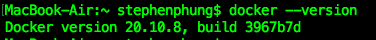
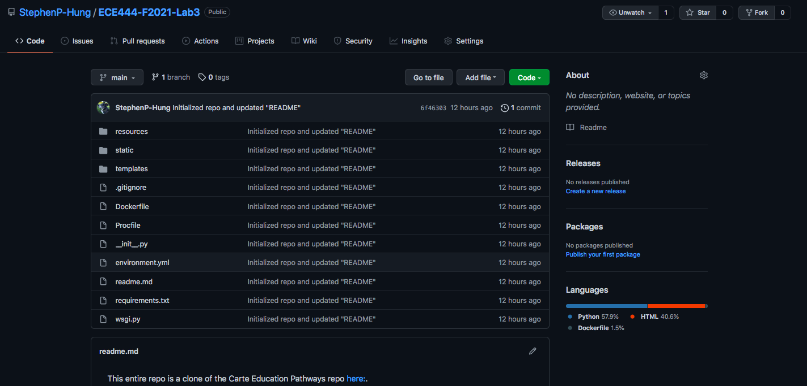
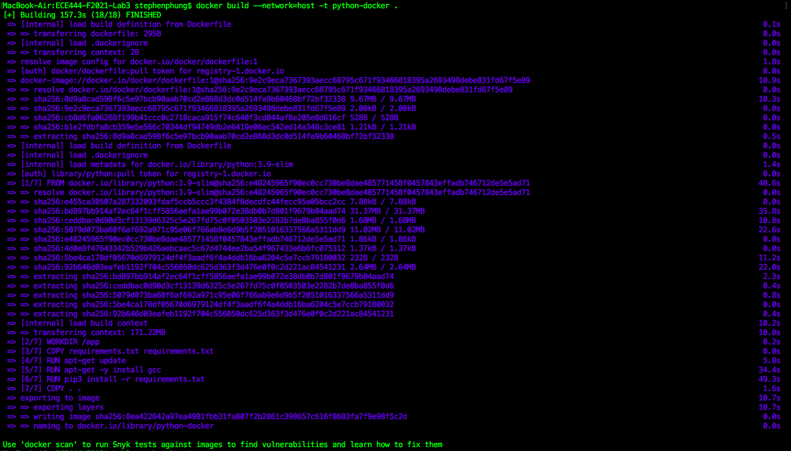
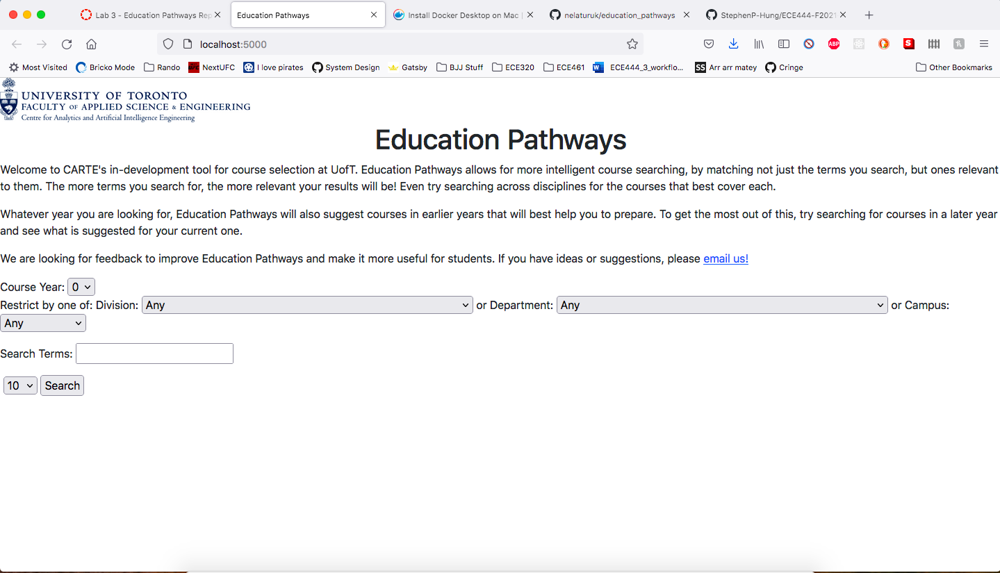

This entire repo is a clone of the Carte Education Pathways repo [here:](https://github.com/nelaturuk/education_pathways).

The screenshots for each part is included below:

# Actvity 1 

# Actvity 2 

# Actvity 3 

# Actvity 4 Part 1 

# Actvity 4 Part 2 

# Activity 5:

# Feedback

__Functional Requirement:__
    - The page should make it easy to display the previous courses a student searched for or care about. Currently, the page has no options to tag/shortlist a course. To improve this, a widget could be added to save a course after it's been found and add it to a user's saved course list.

__Non-functional Requirement:__
    - The page should give an message indicating when a search query yields no results. Currently, it just displays a blank page with no changes. To improve this one would simply add a message saying "Your query had no results. Update your fields to display more courses."